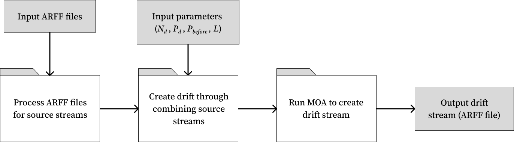

# Datasets and Dataset Generation

## Overview

This README documents the organization of files and methods used to generate the datasets for this repository.


## Directory Organization

The files in this repository that relevant for dataset generation have been listed below.
```.
├── README.md
├── data
│   ├── benchmark
│   │   ├── ECG
│   │   └── IOPS
│   └── synthetic
│       ├── p_before
│       ├── p_drift
│       └── n_drift
├── util
│   ├── convert2arff.py
│   ├── create_drift.py
│   ├── generate_moa_stream.py
│   └── plot_stream.py
├── moa_drift_generation.ipynb
├── view_drift.ipynb
└── requirements.txt
```
 The `data` directory contains the source and generated datasets for this repository. More details can be found in the **Datasets** section.

 The `util` directory contains source code for scripts that are used to help generate drift. The files are detailed in the following table:
| File                   | Purpose                                   |
|------------------------|-------------------------------------------|
| `convert2arff.py`        | Convert .out files to .arff               |
| `create_drift.py`        | Helper functions to create drift          |
| `generate_moa_stream.py` | Class to create drift streams and run MOA |
| `plot_stream.py`         | Class to plot drift stream                |


The following Notebook files are available to execute the above methods and demonstrate their use:
| File                       | Purpose                                  |
|----------------------------|------------------------------------------|
| `moa_drift_generation.ipynb` | Run functions to generate drift stream   |
| `view_drift.ipynb`           | Plot generated drift streams             |


## Environment Set-Up

The current working version of the code runs on Python 3.8.18. The requirements for running the notebooks in this directory can be found in the [`requirements.txt`](../requirements.txt) file. These can be installed on the Zurich server by the following the steps detailed below.

### Setting up on zurich.cas.mcmaster.ca
For the following steps, values indicated within `<>` brackets are to be replaced by the appropriate value.
1) Connect to the Zurich server: `ssh <macid>@zurich.cas.mcmaster.ca` (replacing "`<macid>`" with your login for Zurich).
2) Install conda on the root directory. You can do this by [downloading the Linux installer](https://conda.io/projects/conda/en/latest/user-guide/install/linux.html) locally, copying the installer to the server (`scp <conda installer filepath> <macid>@zurich.cas.mcmaster.ca:anaconda3`), and following the installation instructions from the download link.
3) Create an environment using Python 3.8.18 in conda by running the following command: `conda create -n <myenv> python=3.8.18` (replacing `<myenv>` with your chosen name for the environment).
4) Install `ipykernel` to use the environment with Jupyter Notebooks by running `conda install -c anaconda ipykernel`. Run `python -m ipykernel install --user --name=<myenv>` to install a notebook kernel using this enviornment.

After completing these steps, you should be able to open one of the notebooks listed above and select the kernel that you just created to run the code.

## Datasets

The datasets for this repository can be found under the `data` directory. Datasets found under the `benchmark` subdirectory are published benchmark datasets for the anomaly detection and drift detection tasks. These files are used as the source files for generating drift streams. 

Datasets found under the `synthetic` subdirectory are datasets that have been generated for this paper. Further subdirectories contain data examples with variations of the named parameter. For example, the `p_drift` subdirectory contains different drift streams that vary in percentage of drift, with other parameters held to default values. The `p_drift/p5` subdirectory contains data examples corresponding to the group of streams categorized to be roughly 5% of drift. Drift stream file names also correspond to their characteristics in the following format: 
```
{dataset}_{drift type}_p{percentage drift}_n{number of drifts}_b{percentage before}.arff
```

where dataset refers to the source benchmark dataset for the stream, drift type refers to gradual (grad) or abrupt (abr) and percentage drift, number of drifts, and percentage before are as described in the report.

**Note:** Current files may show with the naminng `a` instead of `b` to denote the percentage of drift which comes after anomalies. This will be refactored with changes to the code.


## Drift Stream Generation

The method for drift stream generation has been documented in the `datageneration` section of the paper. The modules used to generate drift streams can be described by the following diagram:



The functions used to process ARFF files can be found in [`convert2arff.py`](../util/convert2arff.py). The functions used to algorithmically combine source streams and generate the corresponding MOA command can be found in [`create_drift.py`](../util/create_drift.py). The script for running the MOA commannds can be found in [`generate_moa_stream.py`](../util/generate_moa_stream.py).

The Jupyter Notebook [`moa_drift_generation.ipynb`](../moa_drift_generation.ipynb) shows how the functions can be used to create drift streams upon selecting parameter values. The notebook [`view_drift_generation.ipynb`](../view_drift.ipynb) shows how the plotting methods can be used to view generated streams.


## Author
- [Tammy Zeng](https://github.com/tammmyz)