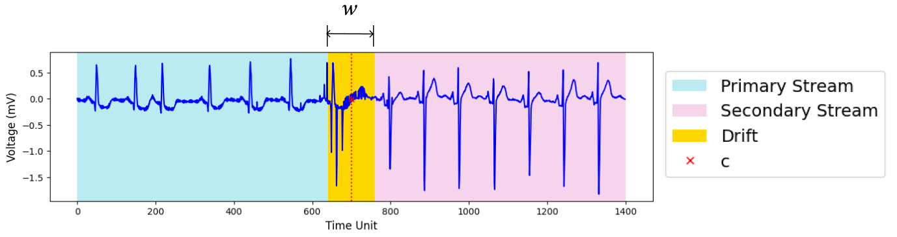
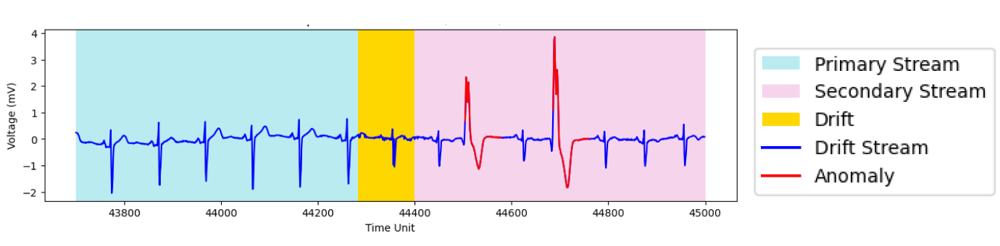
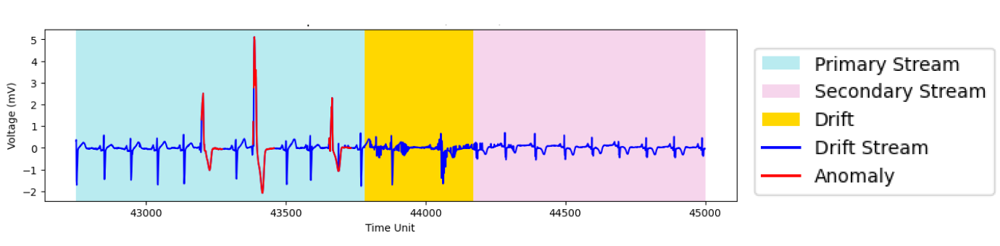
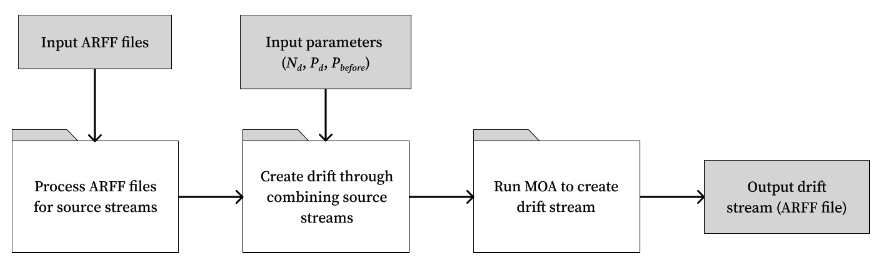

# Datasets and Dataset Generation


## Table of Contents
1. [Overview](#overview)
2. [Background](#background)
3. [Directory Organization](#dir-organization)
4. [Environment Set-Up](#env-setup)
5. [Datasets](#datasets)
6. [Drift Stream Generation](#drift-stream-gen)
7. [Common Issues in Debugging](#common-issues)
8. [References](#references)


<a name="overview"></a>

## Overview

This README documents the organization of files and methods used to generate the datasets for this repository.


<a name="background"></a>

## Background

### Definitions
In this work, **drift** is defined as the transition period between two streams of data originating from distinct concepts. Following [MOA](https://moa.cms.waikato.ac.nz/) documentation for constructing concept drift, the following characteristics can be used to describe a drift: a primary stream, a secondary stream, width, and center position [1]. The following figure shows an illustration of these characteristics.



The primary and secondary stream each indicate a concept of time-series data such that the combination of two streams indicates a concept drift. In our case, the primary and secondary streams refer to ARFF files that store distinct time-series with labelled anomalies. Drift width (*w*) refers to the number of time units in which the drift spans across. Center position of drift (*c*) indicates the time point in the overall stream which corresponds to the center of the drift. For this work we further characterize drift by its location relative to anomalies, namely before and after select anomalies. To explore the impact of drifts on anomaly detection algorithms, we simulated drifts varying the position relative to an anomaly as can be seen in the following figures:




A **drift stream** is defined as a generated data stream which consists of one or more drifts. 

### Drift Stream Parameters

When generating a drift stream using our methods, several parameters can be defined which have been described in the following table:

| Sym.      | Description                    | Values                            |
|-----------|--------------------------------|-----------------------------------|
| $L$       | length of stream               | minimum length of source streams |
| $N_{d}$   | number of drifts               | $N_{d,a20}$, **$N_{d,a30}$**, $N_{d,a40}$ |
| $P_{d}$   | percentage of drift            | 5, 20, **35**, 50, 65, 80        |
| $P_{before}$ | percentage of drift occurring before anomalies (\%) | 0, 25, **50**, 75, 100      |

The length ($L$) of the drift stream is the number of data points (time units) that comprise the stream. The number of drifts ($N_{d}$) denotes how many drifts there are in a drift stream. During drift generation, this is selected based on the desired proportion of anomalies affected by drift ($N_{d,ak}$ for $k$% target affected anomalies). For example, for a data stream which has a total of 200 anomalies, to inject drift surrounding 20% of the anomalies would correspond to $N_d = N_{d,a20} = 40$. Similarly, to inject drift surrounding 30% of the anomalies for the same data stream, a user would specify $N_d = N_{d,a30} = 60$. The percentage of drift refers to the percentage of data points in a stream that are classified as drift, or the sum of all transition periods of gradual drifts. For a stream containing $L$ data points and $N_d$ drifts of varying widths $w_{i}$, the percentage of drift $P_{d}$ can be represented by $P_{d} = \frac{\sum_{i=1}^{N_{d}}sx w_{i}}{L} \times 100\%$. 

Percentage of drift before an anomaly measures the number of injected drifts that have been positioned before and within the neighbourhood of an anomaly. For this work, we generate drift before an anomaly by selecting a position to inject drift which is within $\frac{w}{2}$ time units before an anomaly occurs. For a stream containing $N_{d}$ drifts and $N_{before}$ drifts occurring before anomalies, the percentage of drift before an anomaly ($P_{before}$) can be represented by $P_{before} = \frac{N_{before}}{N_{d}} \times 100\%$.


<a name="dir-organization"></a>

## Directory Organization

The files in this repository that relevant for dataset generation have been listed below.
```.
├── README.md
├── data
│   ├── benchmark
│   │   ├── ECG
│   │   └── IOPS
│   └── synthetic
│       ├── p_before
│       ├── p_drift
│       └── n_drift
├── util
│   ├── convert2arff.py
│   ├── create_drift.py
│   ├── generate_moa_stream.py
│   └── plot_stream.py
├── moa_drift_generation.ipynb
├── view_drift.ipynb
└── requirements.txt
```
 The `data` directory contains the source and generated datasets for this repository. More details can be found in the [Datasets](#datasets) section.

 The `util` directory contains source code for scripts that are used to help generate drift. The files are detailed in the following table:
| File                   | Purpose                                   |
|------------------------|-------------------------------------------|
| `convert2arff.py`        | Convert .out files to .arff               |
| `create_drift.py`        | Helper functions to create drift          |
| `generate_moa_stream.py` | Class to create drift streams and run MOA |
| `plot_stream.py`         | Class to plot drift stream                |


The following Notebook files are available to execute the above methods and demonstrate their use:
| File                       | Purpose                                  |
|----------------------------|------------------------------------------|
| `moa_drift_generation.ipynb` | Run functions to generate drift stream   |
| `view_drift.ipynb`           | Plot generated drift streams             |


<a name="env-setup"></a>

## Environment Set-Up

The current working version of the code runs on Python 3.8.18. The requirements for running the notebooks in this directory can be found in the [`requirements.txt`](../requirements.txt) file. These can be installed on the Zurich server by the following the steps detailed below.

### Setting up on Linux
For the following steps, values indicated within `< >` brackets are to be replaced by the appropriate value.
1) Install conda if not already installed (ie. by [downloading the Linux installer](https://conda.io/projects/conda/en/latest/user-guide/install/linux.html) and following the installation instructions from the download link).
2) Create an environment using Python 3.8.18 in conda by running the following command: `conda create -n <myenv> python=3.8.18` (replacing `<myenv>` with your chosen name for the environment).
3) Activate the conda environment created in the previous step (`conda activate <myenv>`). Install the packages in `requirements.txt` using pip (`pip install -r requirements.txt`).
4) Install `ipykernel` to use the environment with Jupyter Notebooks by running `conda install -c anaconda ipykernel`. Run `python -m ipykernel install --user --name=<myenv>` to install a notebook kernel using this enviornment.
5) Download [MOA](https://moa.cms.waikato.ac.nz/) if you have not already.

After completing these steps, you should be able to open one of the notebooks listed above and select the kernel that you just created to run the code.


<a name="datasets"></a>

## Datasets

The datasets for this repository can be found under the `data` directory. Datasets found under the `benchmark` subdirectory are published benchmark datasets for the anomaly detection and drift detection tasks [2]. These files are used as the source files for generating drift streams. 

Datasets found under the `synthetic` subdirectory are datasets that have been generated for this paper. Further subdirectories contain data examples with variations of the named parameter. For example, the `p_drift` subdirectory contains different drift streams that vary in percentage of drift, with other parameters held to default values. The `p_drift/p5` subdirectory contains data examples corresponding to the group of streams categorized to be roughly 5% of drift. Drift stream file names also correspond to their characteristics in the following format: 
```
{dataset}_{drift type}_p{percentage drift}_n{number of drifts}_b{percentage before}.arff
```

where dataset refers to the source benchmark dataset for the stream, drift type refers to gradual (grad) or abrupt (abr) and percentage drift, number of drifts, and percentage before as described in the [Background](#background) section.


<a name="drift-stream-gen"></a>

## Drift Stream Generation

The method for drift stream generation can be explained in the following series of steps: 

1. Convert existing dataset to ARFF file format.
2. Identify the pool of data streams within the dataset to use as source streams.
3. Identify parameters for desired drift. Note: the current implementation for the algorithm is biased towards producing streams with reduced values compared to the target. For example, when specifying a target percentage drift of 50%, the method may return a stream with 34% drift. To account for this, it is recommended to run the current method with higher values for target parameters and assessing the true values.
4. Run the script for generating and running the MOA command ([`generate_moa_stream.py`](../util/generate_moa_stream.py)) or run the functions individually using a Jupyter Notebook ([`moa_drift_generation.ipynb`](../moa_drift_generation.ipynb)).

The modules used to generate drift streams can be described by the following diagram.



The functions used to process ARFF files can be found in [`convert2arff.py`](../util/convert2arff.py). The functions used to algorithmically combine source streams and generate the corresponding MOA command can be found in [`create_drift.py`](../util/create_drift.py). The script for running the MOA commands can be found in [`generate_moa_stream.py`](../util/generate_moa_stream.py).

The Jupyter Notebook [`moa_drift_generation.ipynb`](../moa_drift_generation.ipynb) shows how the functions can be used to create drift streams upon selecting parameter values. The notebook [`view_drift_generation.ipynb`](../view_drift.ipynb) shows how the plotting methods can be used to view generated streams.


<a name="common-issues"></a>

## Common Issues in Debugging
- **Reading ARFF files**: Check that the `@attribute class` values match the label column of the data (ie. 0.0 is consistent with 0.0 and not 0). Also check that the ARFF file is finished (ie. the last line of the file has 2 entries).
- **Error in running MOA (NullPointer exception)**: When executing the command for MOA, this may occur when you are trying to generate streams that are greater in length than the length of your source streams. Check that the positions of the drift are in strictly increasing order.


<a name="references"></a>

## References
1. Albert Bifet, Geoff Holmes, Richard Kirkby, and Bernhard Pfahringer. 2010.
MOA: Massive Online Analysis. J. Mach. Learn. Res. 11 (2010), 1601–1604.
2. John Paparrizos, Yuhao Kang, Paul Boniol, Ruey S. Tsay, Themis Palpanas,
and Michael J. Franklin. 2022. TSB-UAD: An End-to-End Benchmark Suite
for Univariate Time-Series Anomaly Detection. Proc. VLDB Endow. 15, 8 (apr
2022), 1697–1711.
